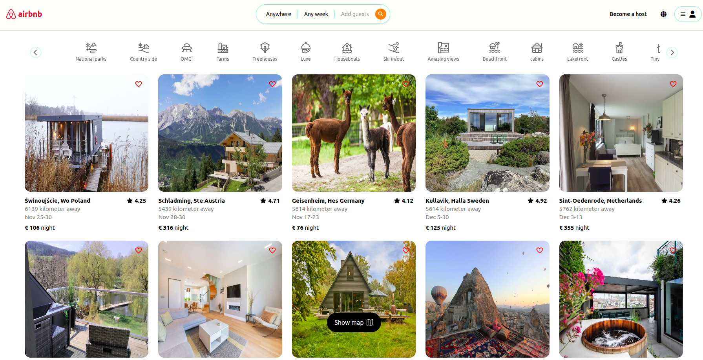
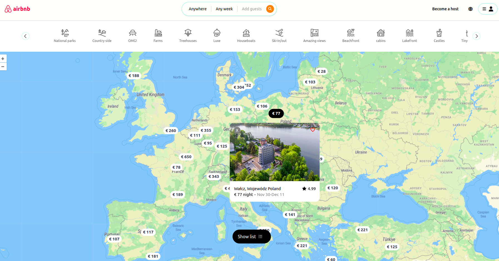
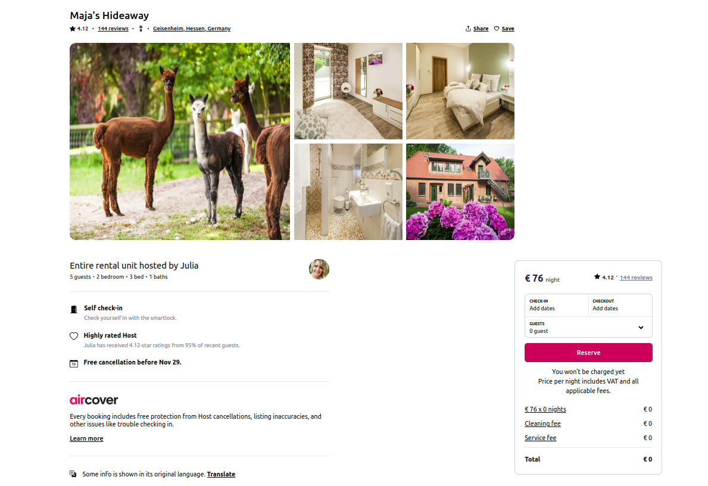

# Airbnb Clone

Airbnb is a popular online platform that allows people to rent out their properties, such as apartments, houses, and rooms, to travelers for short-term stays. The company was founded in 2008 and has since grown into a global hospitality company, with over 4 million hosts in more than 220 countries and regions.

## Link

- Live Site URL: [https://harshita1225.github.io/airbnb-react-group-project/](https://harshita1225.github.io/airbnb-react-group-project/)

## Table of contents

- [Overview](#overview)

- [Link](#link)

- [The challenge](#the-challenge)

- [Screenshot](#screenshot)

- [My process](#my-process)

- [Built with](#built-with)

## Overview

### Project Specifications

- We have designed and developed a website that facilitates the booking of apartments and holiday homes, providing users with a range of features and functionality. The homepage of the website showcases all available apartments for rent, whether it be for a short-term stay or a longer holiday. Users can also access a map page that displays the location of each apartment.

- For each apartment, there is a dedicated page that provides detailed information about the property, including images, amenities, and pricing. From this page, users have the option to reserve the apartment by filling out a form that includes the desired dates of stay and the number of people.

- Once the user has completed the form, the website calculates the cost of the reservation, including any additional fees, and displays a booking confirmation page for the user to review before finalizing the payment. Overall, the website provides a seamless booking experience for users seeking temporary accommodation.

### Screenshot

#### Desktop Version

- HomePage
  

- Map Page
  

- Single Apartment Page
  

## My process

- Home Page
- Login Page
- Map Page
- single apartment Page
- Confirmation Page

### Built with

- Semantic HTML5 markup
- Tailwind
- React js
- CSS

### contributers

- Harshita Joshi
- Hizkiel Mesfin
- Saad Malik
